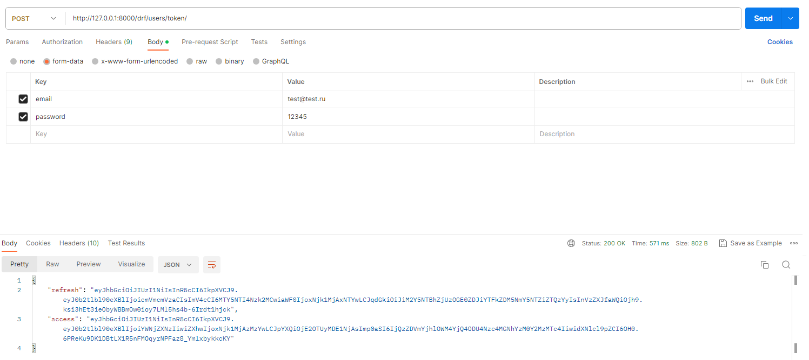

# Модуль Расчета Цен на Маркетплейсе

Это веб-сервис, основанный на Django, который предоставляет конечную точку для расчета цены товара с различными наценками. Конечная точка предназначена для маркетплейса и доступна только аутентифицированным пользователям с статусом "продавец".

## Возможности

- Рассчет конечной цены товара с учетом следующих компонентов:
  - Исходная цена, предоставленная в запросе.
  - 6% налог.
  - 2% комиссия банка за транзакцию.
  - 10% комиссия для автора продукта.
  - 20% комиссия для маркетплейса.
- Гарантирован доступ только авторизованным продавцам.
- 97% кода покрыто юнит-тестами.
- Используется PostgreSQL для хранения данных.

## Установка

1. Клонируйте репозиторий:
   ```shell
   git clone https://github.com/Lekantrop74/Pricing_module.git
   cd marketplace-pricing-module
   ```

2. Создайте виртуальное окружение и активируйте его (опционально, но рекомендуется):
   ```shell
   python -m venv venv
   source venv/bin/activate  # На Windows используйте "venv\Scripts\activate"
   ```

3. Установите необходимые зависимости:
   ```shell
   pip install -r requirements.txt
   ```

4. Создайте файл .env в корневой директории проекта и добавьте в него следующие переменные окружения:
   ```shell
    BASE_NAME=Sky_Pro_DRF_Coursework_9
    BASE_USER=postgres
    BASE_PASSWORD=12345
    HOST=127.0.0.1
    PORT=5432
   ```

5. Примените миграции для создания таблиц базы данных:
   ```shell
   python manage.py migrate
   ```

6. Создайте суперпользователя для доступа к админке:
   ```shell
   python manage.py AddData
   Пользователь: admin@mail.com
   Пароль: 12345
   ```

7. Запустите сервер разработки:
   ```shell
   python manage.py runserver
   ```

## Регистрация и получение токена

Для начала, вам необходимо зарегистрироваться на маркетплейсе, создав аккаунт продавца, и получить токен для доступа к API.

1. Зарегистрируйтесь на маркетплейсе, отправив POST-запрос на `/drf/users/registration/` с данными пользователя:

```json
{
    "email": "test@test.com",
    "password": "12345",
    "password2": "12345",
    "is_seller": true
}
```


2. Затем, получите токен для аутентификации на маркетплейсе, отправив POST-запрос на `/drf/users/token/` с данными:

```json
{
    "email": "test@test.com",
    "password": "12345"
}
```


В ответе на этот запрос вы получите токен, который вы будете использовать для аутентификации в следующих запросах к API.

## Использование

### API-конечная точка для расчета цен

Теперь, когда у вас есть токен, вы можете использовать API-конечную точку для расчета цен.

- URL конечной точки: `/calculate_price/`

### Запрос

- HTTP-метод: POST
- Content-Type: application/json
- Заголовок Authorization: Token YOUR_TOKEN, где YOUR_TOKEN - ваш полученный токен.

Пример тела запроса:

```json
{
    "name": "Товар",
    "price": 100.00
}
```


### Ответ

- HTTP-статус: 201 Created
- Тело ответа:

```json
{
  "Итоговая цена": 138.00
}
```

### Обработка ошибок

- Если поле `name` отсутствует, будет возвращен ответ с ошибкой валидации.
- Если поле `price` отсутствует или не является числом, будет возвращен ответ с ошибкой валидации.
- Если `price` отрицательна, будет возвращена ошибка валидации.

## Запуск тестов

Чтобы запустить юнит-тесты и убедиться, что покрыто как минимум 75% кода:

```shell
coverage run  manage.py test
coverage report    
```

## Дополнительно

- Автор: Королёв Виктор Алексанрович
